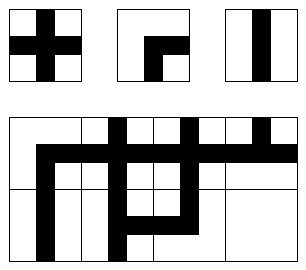
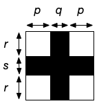
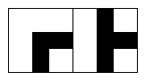

[English version below]

# TDLOG : première séance

Ce fichier présente les exercices de la première séance du module. L'objectif
est de produire un code de qualité (lisibilité, nommage, commentaires) et non
pas de couvrir le maximum d'exercices. Les exercices sont à faire en binôme,
et en anglais (noms des fonctions et variables, commentaires).


## Outils

Le dépôt est configuré pour appliquer les outils
[black](https://github.com/psf/black) (_code formatter_) et
[flake8](https://flake8.pycqa.org/en/latest/) (_linter_) au code. Vous pouvez
les utiliser localement en exécutant respectivement `black .` et `flake8 .` dans
votre copie du dépôt. Pour créer un environnement
[conda](https://anaconda.org/anaconda/conda) avec les paquets nécessaires,
vous pouvez exécuter `conda env create --file environment.yml`.


## Exercices : éléments de base

On souhaite écrire lors de cette séance quelques fonctions manipulant les
éléments constitutifs d'un labyrinthe ou d'un système routier sur une grille. On
considère une grille rectangulaire sur laquelle chaque case peut être connectée
(*i. e.* avoir un segment de route) ou non à chacune de ses 4 voisines. La
figure ci-dessous donne des exemples de cases et de grille :



Exercice : choisir une représentation pour les cases et pour la grille, en
expliquant les éléments saillants en commentaire.

On peut par exemple utiliser des "tuples nommés" qui, comme leur nom l'indique,
permettent de donner des noms aux différentes composantes. Le code ci-dessous
montre comment déclarer et utiliser un tuple nommé pour représenter les
dimensions d'une boîte :

```
import collections

# definition
Size = collections.namedtuple("BoxSize", ["width", "height", "depth"])

# creation
a_size = Size(1, 2, 3) # by position
another_size = Size(depth=3, width=1, height=2) # by name

# component access
print(a_size.width * 4)

# conversion to string
print(another_size)
```

Comme les tuples "classiques", les tuples nommés sont non mutables, et peuvent
être utilisés comme éléments d'ensembles ou clefs de dictionnaires.

Exercice : écrire les fonctions nécessaires pour afficher de manière textuelle
une case et une grille.

Ces fonctions doivent prendre 4 paramètres apparaissant sur la figure suivante
(en leur donnant des noms pertinents) :



Pour l'affichage textuel, on utilisera le caractère `#` pour
représenter les portions de route et le caractère espace
pour les parties sans portion de route. Ainsi, la grille ci-dessus
sera-t-elle affichée textuellement :

```
       #    #    #
       #    #    #
  ##################
  #    #    #
  #    #    #
  #    #    #
  #    #    #
  #    ######
  #    #
  #    #
```

si p = r = 2 et q = s = 1.


## Exercices : générations simple et cohérente

Pour tester superficiellement les fonctions précédentes, on peut se doter d'une
première fonction de génération, qui choisit aléatoirement le contenu de chaque
case indépendamment (donc sans se poser la question de la cohérence avec les
cases voisines).

Exercice : écrire une telle fonction et l'utiliser pour afficher par exemple
une grille aléatoire de largeur 4 et hauteur 3.

Pour améliorer la génération, on souhaite s'assurer que la grille générée est
cohérente. Une grille n'est pas cohérente si une case a une portion de route
vers une case voisine, mais que la case voisine n'a pas la portion de route
correspondante. Par exemple, les deux cases suivantes ne sont pas cohérentes,
car la case de gauche a un segment de route en direction de la case de droite
sans que cette dernière ait le segment correspondant :



Exercice : écrire une fonction qui prend en paramètre une grille et renvoie un
booléen indiquant si la grille est cohérente. On ignore les éventuelles portions
de route aux limites de la grille.

Exercice : écrire une fonction qui génère aléatoirement une
grille cohérente, en générant séquentiellement les cases de
la grille, de telle sorte que lorsqu'une case est ajoutée à la
grille, elle est cohérente avec les cases voisines déjà placées.


## Modules et fonctions utiles

- [Chaînes de caractères](https://docs.python.org/3/library/stdtypes.html#text-sequence-type-str)
- [Listes](https://docs.python.org/3/library/stdtypes.html#lists)
- [Génération de nombres aléatoires](https://docs.python.org/3/library/random.html)
- [Tuples nommés](https://docs.python.org/3/library/collections.html#collections.namedtuple)


# TDLOG: first session

This file contains the exercises for the first session of the course. The
objective is to produce a code of quality (readability, naming, comments)
rather than to cover as many exercises as possible. The exercises must be
done in teams of two, and in English (function and variable names, comments).


## Tools

The repository is set up to apply both [black](https://github.com/psf/black)
(code formatter) and [flake8](https://flake8.pycqa.org/en/latest/) (linter) to
the code. You can run the tools locally by executing respectively `black .` and
`flake8 .` in your copy of the repository. To create a
[conda](https://anaconda.org/anaconda/conda) environment with all the necessary
packages, you can execute `conda env create --file environment.yml`.


## Exercises: basics

Over the course of this session, we want to write a bunch of functions
manipulating the elements representing a labyrinth or road network on
a grid. We are only interested in rectangular grids, where each tile
may be connected (*i.e.* have a road segment) or not to each of its 4
neighbors. The figure below shows examples of tiles and grid:


Exercise: choose a representation for the tiles and the grid, and
explain the choice in a comment.

It is for instance possible to use "named tuples" which, as their name
suggests, let the developer give names to the components of the tuple.
The code below shows how to declare and use a named tuple to
represent the size of a box:

```
import collections

# definition
Size = collections.namedtuple("BoxSize", ["width", "height", "depth"])

# creation
a_size = Size(1, 2, 3) # by position
another_size = Size(depth=3, width=1, height=2) # by name

# component access
print(a_size.width * 4)

# conversion to string
print(another_size)
```

Like "classical" tuples, named tuples are not mutable, and can be used as
set elements or dictionary keys.

Exercise: write the functions needed to print a textual representation of a
tile and of a grid.

These functions must take the 4 parameters (with proper names) on the figure below:


For the textual representation, we will use the `#` character to represent
a part of a road segment, and the space character for the part with no
road segments. This means the grid above will have the following
textual representation:

```
       #    #    #
       #    #    #
  ##################
  #    #    #
  #    #    #
  #    #    #
  #    #    #
  #    ######
  #    #
  #    #
```

if p = r = 2 and q = s = 1.


## Exercises: simple and consistent generation

In order to superficially test the functions above, we can define a simple form
of generation, that randomly chooses the contents of each grid element
independently (thus without testing whether a choice is consistent with the
neighboring elements).

Exercise: write a function randomly generating grid as described above,
and use it to print a random grid of width 4 and height 3.

In order to implement a better generation scheme, we want to test whether
a generated grid is consistent. A grid is not consistent if an element has
a road segment towards a neighboring element, but the neighboring element
does not have the corresponding road segment. For instance, the two
elements below are not consistent, since the tile on the left has a road
segment towards the tile on the right while the one on the right does not
have the corresponding segment:


Exercise: write a function that takes a grid as a parameter and returns a
boolean indicating whether the grid if consistent. We simply ignore the
road segments at the borders of the grid.

Exercise: write a function that randomly generates a consistent grid,
by sequentially generating its elements, in such a way that when an
element is added to the grid it is consistent with the elements already
present.


## Useful modules and functions

- [String type](https://docs.python.org/3/library/stdtypes.html#text-sequence-type-str)
- [List type](https://docs.python.org/3/library/stdtypes.html#lists)
- [Generation of random numbers](https://docs.python.org/3/library/random.html)
- [Named tuples](https://docs.python.org/3/library/collections.html#collections.namedtuple)
